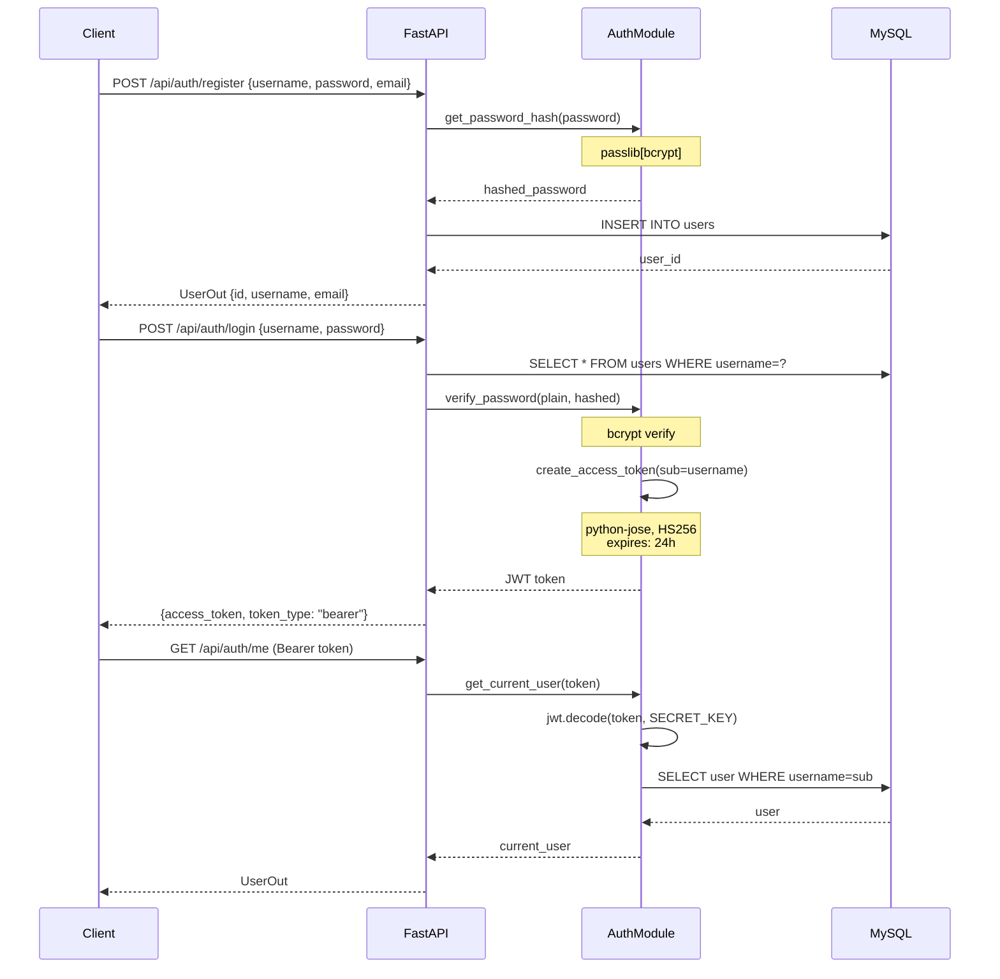
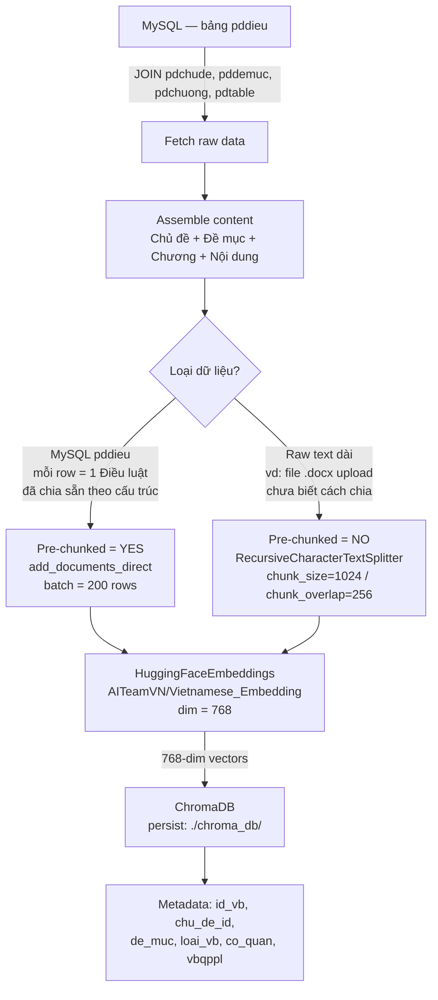
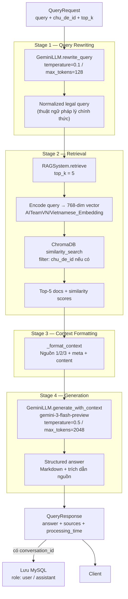
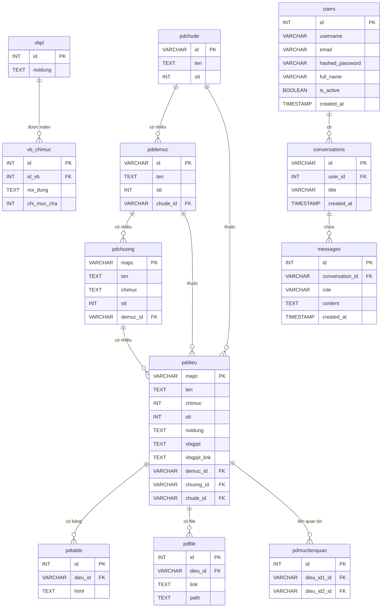
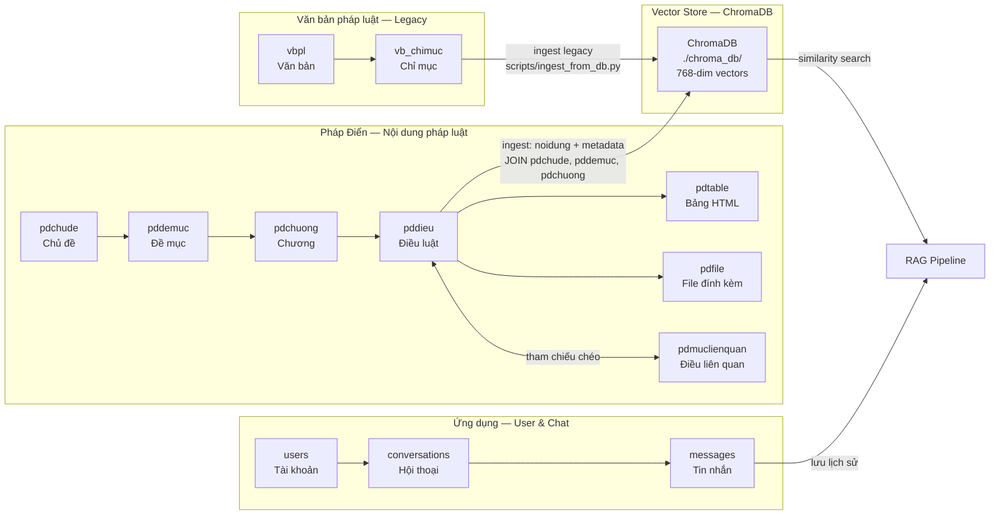
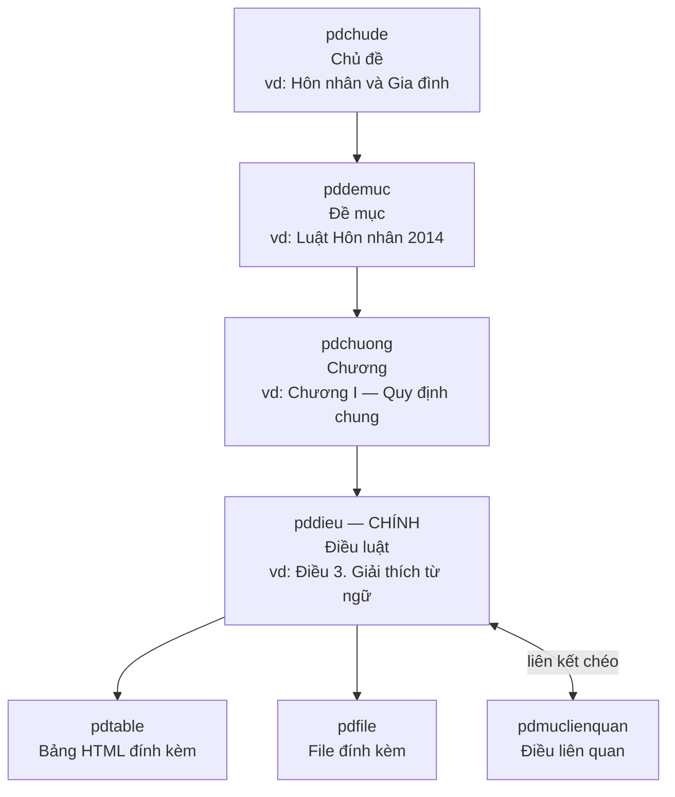
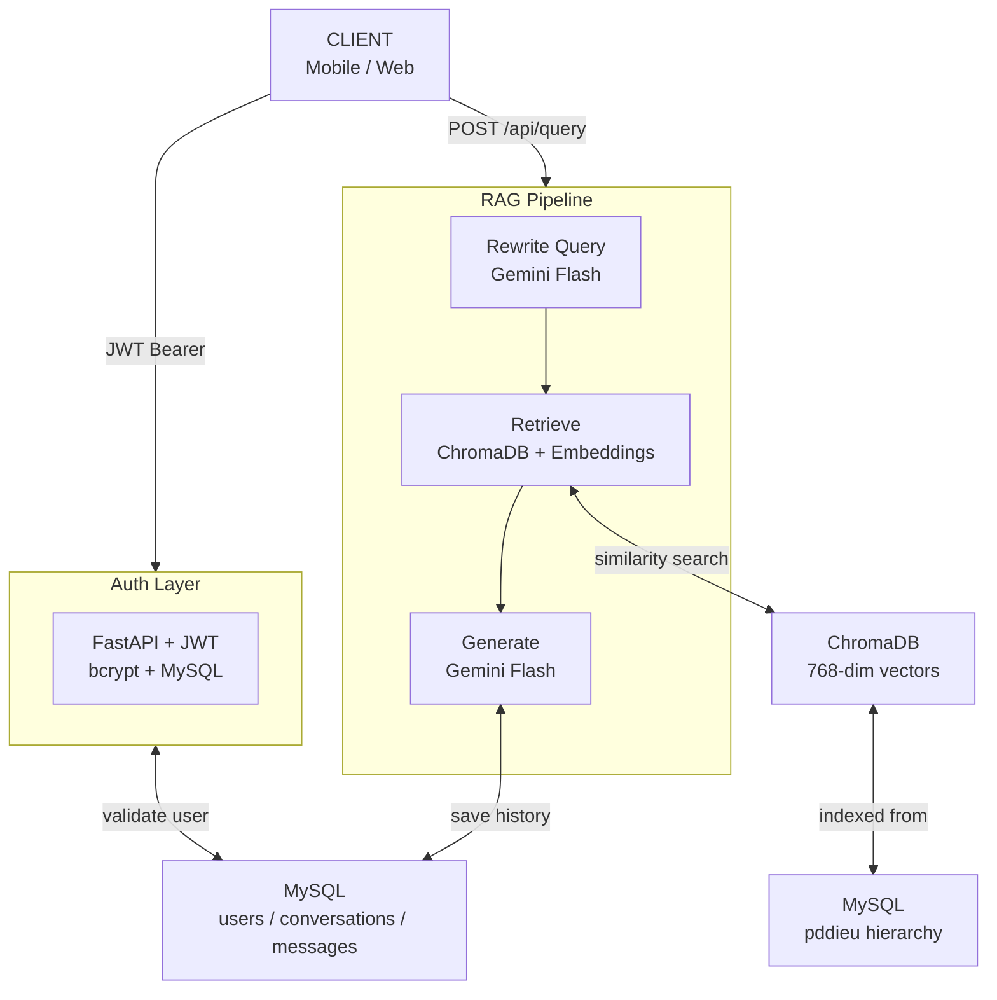

# Backend Diagrams — VN Legal RAG

---

## 1. Auth Flow

**Tech stack Auth:**

| Thành phần | Công nghệ |
|---|---|
| Framework | FastAPI |
| JWT | `python-jose` (HS256) |
| Hash mật khẩu | `passlib[bcrypt]` |
| OAuth2 scheme | `fastapi.security.OAuth2PasswordBearer` |
| Database | MySQL (PyMySQL) |
| Validation | Pydantic v2 |

---

## 2. Embedding Pipeline

**Tech stack Embedding:**

| Thành phần | Công nghệ |
|---|---|
| Embedding model | `AITeamVN/Vietnamese_Embedding` (768 dim) |
| Framework embedding | `sentence-transformers` + `langchain-community.HuggingFaceEmbeddings` |
| Text splitter | `langchain-text-splitters.RecursiveCharacterTextSplitter` |
| Vector store | `chromadb` (Chroma, local persistent) |
| Data source | MySQL via PyMySQL |

---

## 3. RAG Pipeline

**Tech stack RAG:**

| Stage | Công nghệ |
|---|---|
| Query rewriting | `google-genai` Gemini 3 Flash Preview |
| Embedding query | `AITeamVN/Vietnamese_Embedding` (sentence-transformers) |
| Vector retrieval | ChromaDB (`similarity_search_with_relevance_scores`) |
| Context formatting | Python string templating |
| Generation | `google-genai` Gemini `gemini-3-flash-preview` (temp=0.5) |
| Conversation history | MySQL (bảng `conversations` + `messages`) |
| API | FastAPI async |

---

## 4. ERD — Toàn bộ Database

---

## 5. Sơ đồ phân nhóm CSDL theo chức năng

---

## 6. Cấu trúc phân cấp Pháp Điển

---

## 7. Tổng quan toàn hệ thống

---

## Bảng tóm tắt CSDL

| Nhóm | Bảng | Vai trò |
|---|---|---|
| **Pháp Điển** | `pdchude` | Chủ đề pháp luật (level 1) |
| | `pddemuc` | Đề mục / Bộ luật (level 2) |
| | `pdchuong` | Chương (level 3) |
| | `pddieu` | **Điều luật — bảng chính, nguồn cho vector** |
| | `pdtable` | Bảng HTML trong điều |
| | `pdfile` | File đính kèm |
| | `pdmuclienquan` | Quan hệ tham chiếu chéo giữa các điều |
| **Văn bản (Legacy)** | `vbpl` | Toàn văn văn bản pháp luật |
| | `vb_chimuc` | Index theo chương/điều (embed cũ) |
| **Ứng dụng** | `users` | Tài khoản người dùng |
| | `conversations` | Phiên hội thoại (UUID) |
| | `messages` | Tin nhắn user/assistant |
| **Vector Store** | ChromaDB | Lưu trữ embedding từ `pddieu` |
